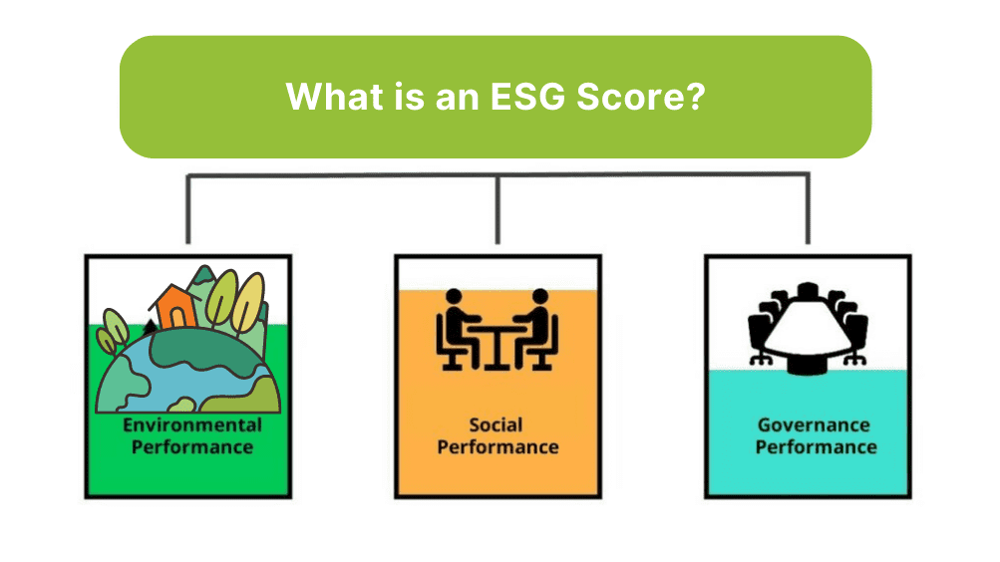

# 📊 S&P 500 ESG Risk Prediction & Analysis

## Leveraging Ensemble Learning to evaluate corporate sustainability and investment risk.
<p align="center">
  
</p>

## 📌 Project Overview
### Context
In the modern financial landscape, Environmental, Social, and Governance (ESG) factors have shifted from "niche metrics" to essential indicators of a company's long-term viability. High ESG risk often correlates with higher volatility and potential financial loss.

This Capstone project focuses on the S&P 500, the backbone of the US stock market. The goal is to build a robust predictive system that can estimate a company's Total ESG Risk Score based on its fundamental pillars and controversial behavior.

### Objective
The primary objective is to evaluate multiple powerful Machine Learning algorithms—specifically Random Forest (RFR), XGBoost, and Gradient Boosting—to find the most accurate predictor for ESG risk. After rigorous tuning, the Random Forest Regressor was selected as the final model for deployment via FastAPI and Docker.

### **ESG Parameters**

In the world of ESG risk analysis, certain parameters stand as beacons, illuminating a company's ethical journey:

1. **Environmental Risk Score**: Quantifies a company's ecological responsibility and impact, reflecting its commitment to safeguarding the planet.
2. **Governance Risk Score**: Evaluates the transparency, ethics, and quality of corporate governance, influencing long-term viability.
3. **Social Risk Score**: Measures a company's societal contributions, spanning employee welfare, diversity, and community engagement.
4. **Controversy Level**: A nuanced gauge ranging from "Low" to "High," gauging public or legal controversies linked to the company.
5. **Controversy Score**: Numerically quantifies the intensity of controversies, offering insights into reputational risks.

### 📊 About the Dataset
* ### 🔗 Data Source:
   Publicly available on Kaggle: S&P 500 ESG Risk Ratings: 
   https://www.kaggle.com/datasets/pritish509/s-and-p-500-esg-risk-ratings

* #### 📁 Technical Note on Data Handling:
   I recommend loading the data from the main repository as I have renamed the file to sp_500_risk_rating.csv (located in the /content/ directory) for code consistency.

* The relevance of ESG risk analysis is vividly demonstrated by our dataset, which exclusively features companies from the influential S&P 500 index. Researchers, investors, analysts, and policymakers alike can harness this dataset to gain profound insights into the ESG performance and risk profiles of these corporate giants. Whether unraveling trends, performing comprehensive ESG assessments, or making informed investment choices, this dataset is a treasure trove for understanding the sustainability and governance ethos of S&P 500 companies. As we explore our dataset, we weave the narrative of how ESG risk analysis imparts strategic foresight and empowers stakeholders to navigate the complexities of an ESG-driven landscape.


### 🔍 The Notebook: "ESG Risk Analysis"
The core of this project is the "ESG Risk Analysis" Jupyter Notebook. It documents the entire end-to-end data science pipeline:

* #### Data Preparation:
   Cleaning specific columns and handling missing values.

* #### Advanced EDA:
   Utilizing sophisticated visualizations like Sunburst Charts, Ridge Plots, and Boxenplots to uncover hidden risk patterns across sectors.

* #### Parameter Tuning:
  Conducting hyperparameter optimization for XGBoost, Gradient Boosting, and Random Forest to minimize error metrics.

* #### Model Selection:
  Comparing performance and selecting the Random Forest Regressor for its superior stability and predictive power on this dataset.

*  #### Export:
  Saving the final model and preprocessor into a Pickle file for production use.

### 🎨 Exploratory Data Analysis Highlights
Here are some key insights from our exploration:

* #### Sunburst Hierarchy:
   Visualizing how risk radiates from broad sectors down to specific industry niches.

* ### Risk Density (Ridge Plot):
  Observing how the "mountain range" of risk shifts significantly as Controversy Levels increase.

### 🛠️ Development Environment
For the best experience in reviewing and running this project, it is recommended to use the following tools:

* #### IDE:
  Visual Studio Code (VS Code) is highly recommended.

* #### Extensions:
  The Python and Docker extensions for VS Code are helpful for managing the container and the notebook.

* #### Terminal:
  You can use the integrated terminal in VS Code (Ctrl + `) to run the commands below.
* #### Docker Desktop:
  Make sure to open Docker Desktop before building the container.
  
### 🚀 How to Run the Project
* Ensure you have the dataset (sp_500_risk_rating.csv) in the root directory before starting 

* Follow these steps to deploy the ESG Risk Prediction service using Docker.

#### 1. Build the Docker Image
Open your terminal in the project directory and run the following command to build the container. **Note:** Don't forget the dot at the end!

```bash
docker build -t esg-risk-app .
```
#### 2. Run the Container
Once the build is complete, start the service by mapping the ports:

```bash
docker run -p 8888:8888 esg-risk-app
```

#### 3.🌐 Accessing the API Interface
After successfully building and running your container, the FastAPI Swagger UI will be hosted on your local machine.

1. Open your browser and navigate to:

   http://localhost:8888/docs

2. Interact with the Model:

* Locate the /predict endpoint.

* Click "Try it out".

* Click Execute to view the results.

### 🛠️ Environment Setup & Containerization
  I have detailed the specific command lines below for anyone interested in replicating the environment or building the container from scratch.

#### 1. Environment Setup with Poetry
 We use Poetry to manage dependencies and virtual environments. This ensures the project remains stable and reproducible.

How to install Poetry? Run the following command in your terminal:

``` bash

(Invoke-WebRequest -Uri https://install.python-poetry.org -UseBasicParsing).Content | py -
# $env:Path += ";C:\Users\MANEL\AppData\Roaming\pypoetry\venv\Scripts"
```

#### 2.Project Initialization: Initialize your project configuration:
```Bash

poetry init
```
Note: When you run poetry init, you will be asked to enter information for your file. At this point, I recommend skipping entering dependencies because it may generate an error.

#### 3.Adding Dependencies: Add your dependencies manually after the project creation:

``` Bash

poetry add fastapi scikit-learn uvicorn requests
```
You can add other dependencies as needed, but make sure to type the following after every update of the pyproject.toml file:

``` Bash

poetry lock
```
#### 4.Web Server:
  We use Uvicorn, which is a lightweight and fast ASGI server, to run our FastAPI applications.
  
#### 5. The Dockerfile Logic
* The Dockerfile was built using the `python:3.11-slim` image from Docker Hub to ensure a lightweight footprint. It serves our FastAPI application using Uvicorn, a high-performance ASGI server.

* Port Mapping: The application is configured to expose and run on Port 8888.

* Build Verification: When building the image (`docker build -t esg-risk-app .`), the process ensures all Poetry-locked dependencies are installed and the Random Forest pickle file is correctly placed in the working directory.


